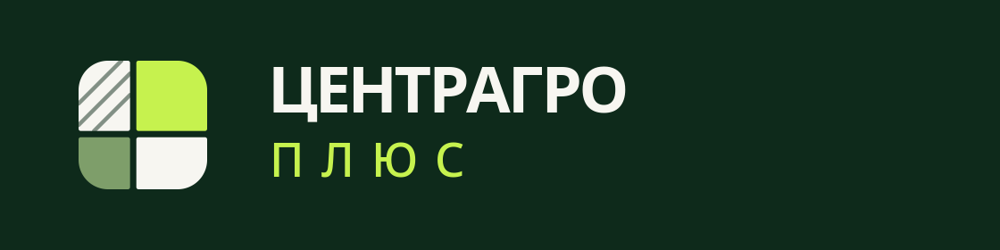
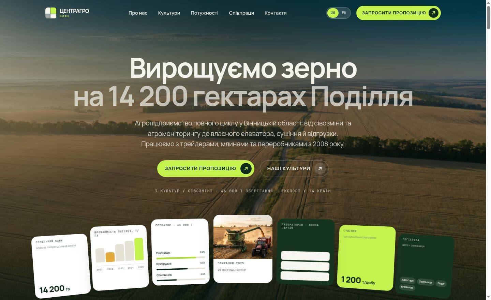

<div align="center">



### Демо-сайт агропредприятия — три вариации, UA / EN

Статика без фреймворка и без build-шага на сервере.
Ни одного стороннего запроса из браузера.

<p>


</p>



</div>

---

## Что это

Демонстрационный сайт вымышленного агропредприятия **ТОВ «ЦЕНТРАГРО ПЛЮС»**
(Винницкая область), собранный в **трёх независимых вариациях** — чтобы показать
заказчику три разных подачи одного и того же содержания.

| Вариация | Направление | Главный экран | Контакты | Поверхности |
|---|---|---|---|---|
| **V1** `/` | **Light** — белая канва, парящие карточки с тенью | центр + веер карточек-виджетов | серая панель ⅓ + фото ⅔, форма-карточка поверх фото | тень, радиус 24 |
| **V2** `/v2/` | **Banded** — тёмные полосы вперемешку со светлыми | текст слева + портрет + автолента | серый лоток: форма 69% + вертикальная фото-полоска | hairline-рамки, радиус 12 |
| **V3** `/v3/` | **Quiet** — контейнеров нет, всё на линиях и воздухе | центр + портрет + стеклянная лента логотипов | без фото и без карточек, форма голая на белом | только линии |

Каждая вариация несёт класс на `<body>` (`v1`/`v2`/`v3`), а `src/css/07-variants.css`
переопределяет поверхности, шкалу и акценты. Порядка секций оказалось мало —
с одинаковой обработкой поверхностей три вариации читались как один сайт,
переставленный местами.

У каждой вариации есть 5 основных страниц, 6 полноценных статей и 4 профиля
команды в двух локалях: **90 локализованных страниц**, `variants.html` для выбора
и `404.html`. Всего в clean build — **92 HTML-файла**.

**Живая версия:** https://xxxquide.github.io/Agro-Site/ ·
[выбор вариаций](https://xxxquide.github.io/Agro-Site/variants.html) ·
[English](https://xxxquide.github.io/Agro-Site/en/)

> [!IMPORTANT]
> **Все данные демонстрационные.** Гектары, урожайность, ёмкость элеватора,
> показатели лаборатории, расстояния, имена сотрудников, отзывы, телефон, e-mail,
> новости и названия партнёров придуманы для наполнения макета. Реальный — только
> адрес предприятия. Координаты в `LocalBusiness` получены геокодированием по
> этому адресу и перед продакшеном требуют проверки. Все фотографии
> сгенерированы; стоковые изображения не использовались.

## Типографика: почему не Plus Jakarta Sans

Исходный шаблон задаёт **Plus Jakarta Sans** (заголовки и текст) + **Geist Mono**
(кнопки, теги). Geist Mono взят как есть — кириллица в нём полная. Plus Jakarta
Sans пришлось заменить, и вот проверка, на которой это выяснилось:

| Источник | Кодпоинтов | Кириллица |
|---|---:|---|
| `google/fonts` → `PlusJakartaSans[wght].ttf` | 721 | нет |
| `tokotype/PlusJakartaSans` (официальный апстрим) | 721 | нет |
| Google Fonts CDN, сабсет `cyrillic-ext` | — | **объявлен, но в файле только U+0020 и U+0308** |

Последняя строка — ловушка: CSS от Google **декларирует** кириллический
`unicode-range`, поэтому проверка `@font-face` «доказывает» поддержку, которой
нет. Правду говорит только `cmap` самого файла. Поэтому
`tools/build_fonts.py` содержит утверждение, которое валит сборку, если семейство
перестанет покрывать украинский.

Замена — **Onest**: при рендере рядом на 52px/700 латиница практически
неотличима от Plus Jakarta Sans (тот же геометрический скелет, та же высокая
x-height), кириллица полная. Итого из двух шрифтов шаблона один точный, второй —
визуально ближайший.

## Логотипы партнёров

Настоящие марки украинских компаний тут не используются намеренно: сайт заявлял
бы партнёрство, которого нет, чужими товарными знаками. Шаблон по той же причине
заполняет эту ленту Logoipsum. Здесь — свой набор из десяти марок в трёх разных
построениях (символ слева, знак в залитой плашке, только шрифт), с индивидуальным
весом и трекингом у каждой. Разнотипность и есть то, что заставляет ленту читаться
как список клиентов, а не как заглушка.

## Motion

Анимации сделаны на **GSAP + ScrollTrigger + Lenis** — тем же инструментом, что и
исходный шаблон, плюс инерционный скролл.

Предыдущая итерация была на `IntersectionObserver` и весила 2 KB, но умела только
«появился/исчез». Ничего нельзя было привязать к **прогрессу** скролла, поэтому
параллакс, ленты и веер карточек «щёлкали» на месте вместо того, чтобы двигаться
вместе со страницей. `scrub` даёт настоящее scroll-linked движение, а Lenis
сглаживает ввод колеса, который это движение питает.

Резкость, на которую ты жаловался, была не в библиотеке, а в параметрах:

| Что | Было | Стало |
|---|---|---|
| reveal при скролле | 0.7s, ход 1.6rem | 1.15s, ход 2.75rem, `expo.out` |
| аккордеон культур | 0.62s, открытие сразу по `mouseenter` | 1.4s + hover-intent 130ms |
| карточки | 0.6s, scale .975 | 1.5s, scale .955, `expo.out` |
| счётчики | 1.25s | 2.0s |
| заголовки | появлялись целиком | пословно, stagger 45ms, выезд из-под линии |

Добавлено то, чего не было, а в шаблоне есть: автолента карточек под hero (V2),
стеклянная лента логотипов (V3), две ленты тегов навстречу друг другу, параллакс
на фото, непрерывная орбита и отдельная композиция motion для внутренних hero.

Все бесконечные ленты и орбиты приостанавливаются вне viewport, при скрытой
вкладке и при взаимодействии с содержимым. `prefers-reduced-motion: reduce`
убирает scrub, autoplay и reveal-трансформации, но оставляет весь контент видимым.
Изменение системной настройки во время открытой страницы безопасно перезапускает
motion-слой. Мобильный drawer получает focus trap, делает основной контент
`inert` и возвращает фокус на кнопку после закрытия. FAQ работает как
эксклюзивный accordion с animated close, testimonial rails принимают touch swipe,
а hover-lift карточек имеет эквивалентный `focus-visible` state.

## Замеренный вес

`tools/verify.py`, gzip -9. Фактический размер артефактов, не оценка.

| Ресурс | Raw | Gzip |
|---|---:|---:|
| `index.html` (V1, uk) | 97.0 KB | **20.3 KB** |
| `assets/css/main.css` | 96.7 KB | **18.9 KB** |
| `assets/js/app.js` | 20.2 KB | **6.2 KB** |
| GSAP + ScrollTrigger + Lenis | 127.7 KB | **48.8 KB** |
| `onest.woff2` + `geistmono.woff2` | 51.2 KB | — |
| LCP `hero-v1-1440.avif` | 36.2 KB | — |
| **Первый экран целиком** | | **181.5 KB** |

Checkpoint первого quality pass давал 174.0 KB. Прирост 7.5 KB приходится на
локальную карту Украины, общие StatsCard/MediaFrame/IconBadge компоненты,
расширенную проверяемую motion-логику и ссылки на detail routes. Новых
runtime-библиотек и сторонних запросов не добавлено.

Изображений в репозитории 6.9 MB — 128 файлов, все плотности и форматы; браузер
грузит из них единицы. AVIF + WebP через `<picture>`, `width`/`height` на каждом
`` (CLS ≈ 0), `preload` только на LCP-картинке.

`tools/measure_runtime.py` даёт воспроизводимую локальную диагностику CLS,
локального LCP, long tasks и frame interval p50/p95/p99 для трёх вариантов на
desktop и mobile. Это не field Core Web Vitals: Lighthouse и реальные
LCP/INP всё равно нужно повторить на живом HTTPS-хостинге и физических устройствах.

## SEO

- Свои `title` / `description`, `canonical` и `hreflang` uk/en/x-default на всех 90 локализованных страницах
- Open Graph + Twitter Card, свои OG-картинки 1200×630 на локаль
- JSON-LD по типу страницы: `Organization` (+`hasOfferCatalog` по семи культурам,
  +`employee`), `LocalBusiness`, `WebSite`, и далее `WebPage` / `AboutPage` /
  `CollectionPage` / `ContactPage` / `ProfilePage`, `Article`, `Person`, `FAQPage` и `ItemList`
- **Вариации 2 и 3 помечены `noindex, follow`.** Это один и тот же контент в другой
  вёрстке; три проиндексированные копии сайта одной компании конкурировали бы
  между собой. В `sitemap.xml` попадает только V1 — 30 URL: основные страницы, статьи и профили в UA/EN.
- `robots.txt`, `sitemap.xml`, `site.webmanifest`, `theme-color`
- Один `h1` на страницу, непрерывная иерархия заголовков, landmarks, `alt` везде,
  skip-link, `:focus-visible`, `aria-expanded`, `<time datetime>` в ISO
- Сгруппированные разряды («14 200») связаны `&nbsp;` на этапе сборки, чтобы число
  не разрывалось между строками

## Структура

```
├── index.html  about/  services/  blog/  contacts/     ← основные V1, uk
├── blog/<slug>/                                         ← 6 статей на вариант и локаль
├── about/team/<slug>/                                   ← 4 профиля на вариант и локаль
├── v2/ …  v3/ …                                        ← те же routes для V2, V3
├── en/ …  en/v2/ …  en/v3/ …                           ← полный набор в EN
├── variants.html · 404.html · robots.txt · sitemap.xml
├── assets/
│   ├── css/main.css        ← сборка из src/css/*, минифицировано
│   ├── js/app.js           ← сборка из src/js/app.js
│   ├── js/vendor/          ← GSAP, ScrollTrigger, Lenis (самохостинг)
│   ├── fonts/ img/ icons/
├── content/
│   ├── uk.json  en.json    ← весь текст, структуры совпадают ключ в ключ
│   └── variants.json       ← описание трёх вариаций
├── src/                    ← источники CSS и JS (править здесь)
├── templates/
│   ├── base.html.j2        ← общая обёртка
│   ├── blocks.html.j2      ← библиотека секций (макросы)
│   ├── icons.html.j2       ← свой набор иконок
│   ├── ukraine-map.svg.j2  ← локальный CC0-контур и route overlay
│   └── pages/*.html.j2     ← основные, article и profile templates
└── tools/
```

Вариации не дублируют вёрстку: они собирают страницы из одних макросов в разном
порядке — `variants.json` описывает, какой hero, какие секции и в какой
последовательности. Новая вариация — это запись в JSON, не копия шаблонов.

## Как пересобрать

```bash
pip install jinja2 rcssmin rjsmin pillow fonttools brotli cairosvg

python3 tools/build_fonts.py      # woff2 из апстримных TTF + проверка кириллицы
python3 tools/build_logo.py       # логотип, favicon, apple-touch-icon
python3 tools/build_images.py      # AVIF + WebP (нужны исходные кадры)
python3 tools/build_og.py          # OG-картинки
python3 tools/extend_content.py    # добавляет блоки страниц в uk.json
python3 tools/build_site.py        # 91 content HTML + 404 + CSS/JS + robots/sitemap
python3 tools/verify.py            # проверки и бюджеты; ненулевой код = FAIL
```

Обычный цикл правок:

```bash
python3 tools/build_site.py && python3 tools/verify.py
```

`tools/build_preview.py` собирает страницу в один self-contained HTML со
встроенными CSS, JS, шрифтами и картинками — удобно отправить файлом.

### Browser QA

Визуальные и интерактивные проверки используют Playwright только как dev-зависимость:

```bash
pip install playwright
python3 -m playwright install chromium

python3 tools/visual_smoke.py
python3 tools/interaction_smoke.py
python3 tools/measure_runtime.py
```

`visual_smoke.py` снимает детерминированные скриншоты основных и representative
detail pages с reduced motion на 320, 375, 390, 768, 1024, 1440 и 1920 px.
Проверяются horizontal overflow, один `h1`, clipped text, media coverage внутри
rounded masks, marquee overlap, видимые изображения и скрытый после boot контент.
Артефакты пишутся в игнорируемую папку `.visual-regression/`.

`interaction_smoke.py` проверяет mobile drawer, focus trap, все V3 testimonial
rails, double marquee, exclusive accordion, hover lift, detail routes, demo-формы,
reduced-motion и no-JS fallback. `measure_runtime.py`
записывает локальные диагностические p50/p95/p99 в
`.visual-regression/runtime.json` и явно не выдаёт их за field CWV.

### Что где править

| Задача | Файл |
|---|---|
| Текст, статьи, профили, цифры, команда, услуги | `content/uk.json` + `content/en.json` |
| Состав и порядок секций вариации | `content/variants.json` |
| Цвета, шрифтовая шкала, отступы, тени | `src/css/01-tokens.css` |
| Тайминги и кривые анимаций | `DUR` / `EASE` в начале `src/js/app.js` |
| Разметка секции и shared components | `templates/blocks.html.j2` |
| Article / profile layouts | `templates/pages/article.html.j2` + `profile.html.j2` |
| Карта и источник | `templates/ukraine-map.svg.j2` + `docs/map-source.md` |
| Иконки | `templates/icons.html.j2` |
| Домен | `BASE` и `SUBPATH` в `tools/build_site.py` |

`verify.py` проверяет паритет структуры `uk.json` и `en.json`, отсутствие битых
ссылок, дубли `id`, `alt` и размеры у картинок, порядок заголовков, типы e-mail
полей, сохранение native form validation, 92-page count, 36 Article и 24 Person
routes, валидность JSON-LD, внутренние ссылки, `noindex` и бюджеты веса.

## Карта

Geography использует локальный inline SVG без tile API и runtime-запросов.
Контур получен из Natural Earth Admin 0 1:10m, упрощён и дополнен точками
Винницы, Гайсина, Киева и порта Одессы. Источник, commit, координаты и
public-domain/CC0 условия зафиксированы в `docs/map-source.md`.

## Деплой

GitHub Pages, режим **Deploy from a branch** — workflow не нужен, в репозитории
лежит собранный результат.

**Settings → Pages → Source: Deploy from a branch → Branch: `main` / `(root)` → Save.**

## Лицензии

Код свободен к использованию. **Onest** и **Geist Mono** — SIL Open Font License 1.1.
**GSAP** — стандартная лицензия GreenSock (бесплатна для этого типа использования),
**Lenis** — MIT. Natural Earth boundary data — public domain; GeoJSON conversion
and map provenance are documented in `docs/map-source.md`. Изображения
сгенерированы для этого макета.
