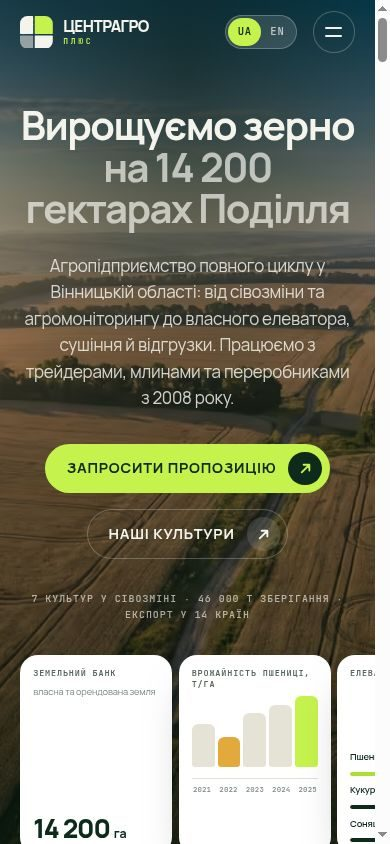

<div align="center">


### Демо-лендинг для агропредприятия · UA / EN

Статический двуязычный сайт-визитка. Без фреймворка, без build-шага на сервере,
без единого стороннего запроса из браузера.

<p>


</p>


</div>

---

## Что это

Демонстрационный лендинг для вымышленного агропредприятия **ТОВ «ЦЕНТРАГРО ПЛЮС»**
(Винницкая область). Сделан как показательный пример уровня сайта: полный цикл —
от логотипа и фотоконтента до SEO и структурированных данных.

**Живая версия:** https://xxxquide.github.io/Agro-Site/ · [English](https://xxxquide.github.io/Agro-Site/en/)

> [!IMPORTANT]
> **Все данные на сайте — демонстрационные.** Гектары, урожайность, ёмкость
> элеватора, показатели лаборатории, расстояния, отзывы, имена, телефон, e-mail и
> новости придуманы для наполнения макета. Реальный — только адрес предприятия.
> Координаты в `LocalBusiness` JSON-LD получены геокодированием по этому адресу и
> перед продакшеном требуют проверки. Все фотографии сгенерированы, стоковые
> изображения не использовались.

<table>
<tr>
<td width="60%" valign="top">

## Технические решения

**Почему не React / Next.** Для одностраничного лендинга с двумя локалями
фреймворк добавляет 80–120 KB рантайма, гидратацию и обязательный CI-билд, не
давая ничего взамен: на странице нет состояния, которое стоило бы синхронизировать.
Здесь HTML отдаётся готовым, а JS занимается только анимациями и аккордеонами.

**Почему выброшен GSAP.** Исходный шаблон, взятый за визуальную основу, тянул
GSAP + ScrollTrigger + Draggable + Observer + jQuery + Swiper — около 250 KB JS.
Всё переписано на `IntersectionObserver` и CSS-keyframes: **2.1 KB gzip**.
Ни одного `scroll`-обработчика в коде — именно они обычно и дают дёргание.
Анимируются только `transform` и `opacity`, то есть работу делает compositor.

**Почему свои шрифты, а не Google Fonts CDN.** Готовые subset-файлы Google для
трёх семейств весили 282 KB, потому что каждый «latin» subset несёт весь
Latin-Extended. Апстримные variable TTF пересобраны через `fontTools` под точный
набор глифов (basic Latin + украинская кириллица + типографика) → **34.3 KB**
на оба языка и все насыщенности. Плюс ноль внешних соединений.

**Почему две HTML-страницы, а не JS-переключатель.** Один URL на два языка — это
потеря обеих локалей в поиске. Здесь `/` (uk) и `/en/` — самостоятельные
документы со своими `title`, `description`, `canonical`, OG-картинкой и записью в
`sitemap.xml`, связанные `hreflang` + `x-default`.

</td>
<td width="40%" valign="top">



</td>
</tr>
</table>

## Замеренный вес

Числа получены `tools/verify.py` на собранных файлах, gzip -9. Это фактический
размер артефактов, а не оценка.

| Ресурс | Raw | Gzip |
|---|---:|---:|
| `index.html` (uk) | 87.5 KB | **15.8 KB** |
| `en/index.html` | 77.7 KB | **13.6 KB** |
| `assets/css/main.css` | 44.7 KB | **9.5 KB** |
| `assets/js/app.js` | 5.4 KB | **2.1 KB** |
| `assets/fonts/manrope.woff2` | 21.5 KB | — |
| `assets/fonts/jbmono.woff2` | 12.8 KB | — |
| LCP-изображение `hero-field-1440.avif` | 56.1 KB | — |
| **Первый экран целиком** | | **117.8 KB** |

Изображений в репозитории 5.5 MB — это 90 файлов, все варианты плотностей и
форматов; браузер грузит из них единицы.

**Что ещё сделано для скорости:** AVIF + WebP через `<picture>` с `srcset`;
`width`/`height` на каждом `` (CLS ≈ 0); `preload` + `fetchpriority=high`
только на LCP-картинке, всё остальное `loading=lazy` + `decoding=async`;
marquee и орбита останавливаются за пределами вьюпорта; полная ветка
`prefers-reduced-motion: reduce`.

**Что не замерено:** Lighthouse и реальные Core Web Vitals. Запустить их можно
только на живом хостинге — цифры выше это вес ассетов, а не LCP/INP на устройстве.

## SEO и разметка

- `title` / `description` / `canonical` / `hreflang` (uk, en, x-default) на каждую локаль
- Open Graph + Twitter Card, свои OG-картинки 1200×630 на язык
- JSON-LD `@graph`: `Organization` (с `hasOfferCatalog` по семи культурам),
  `LocalBusiness` (адрес, координаты, часы), `WebSite`, `WebPage`, `FAQPage`
- `robots.txt`, `sitemap.xml` с обеими локалями, `site.webmanifest`, `theme-color`
- Один `h1`, непрерывная иерархия заголовков, landmarks, `alt` на каждом изображении,
  `aria-label` на иконочных кнопках, skip-link, `:focus-visible`, `aria-expanded`
  на аккордеонах, `<time datetime>` в ISO

## Структура

```
├── index.html              ← сборка, локаль uk
├── en/index.html           ← сборка, локаль en
├── 404.html
├── robots.txt · sitemap.xml · site.webmanifest · .nojekyll
├── assets/
│   ├── css/main.css        ← сборка: fonts.css + src/css/*, минифицировано
│   ├── js/app.js           ← сборка: src/js/app.js, минифицировано
│   ├── fonts/*.woff2       ← subset variable-шрифты
│   ├── img/                ← AVIF + WebP, 2 плотности + manifest.json
│   └── icons/              ← логотип, favicon, apple-touch-icon
├── content/
│   ├── uk.json             ← весь текст украинской версии
│   └── en.json             ← весь текст английской версии
├── src/                    ← источники CSS и JS (править здесь)
├── templates/page.html.j2  ← один шаблон на обе локали
└── tools/                  ← генераторы и проверки
```

## Как пересобрать

Нужен Python 3.9+. Зависимости — только для сборки, в рантайме их нет.

```bash
pip install jinja2 rcssmin rjsmin pillow fonttools brotli cairosvg

python3 tools/build_fonts.py    # subset woff2 из апстримных variable TTF
python3 tools/build_logo.py     # логотип, favicon, apple-touch-icon, lockup
python3 tools/build_images.py   # AVIF + WebP из исходников (нужны исходные кадры)
python3 tools/build_og.py       # OG-картинки 1200×630
python3 tools/build_site.py     # HTML обеих локалей + CSS/JS bundle + robots/sitemap
python3 tools/verify.py         # проверки и бюджеты; ненулевой код = есть FAIL
```

Обычный цикл правок — только последние две команды:

```bash
python3 tools/build_site.py && python3 tools/verify.py
```

`tools/build_preview.py` собирает каждую страницу в один self-contained HTML со
встроенными CSS, JS, шрифтами и картинками — удобно отправить заказчику файлом.

### Что где править

| Задача | Файл |
|---|---|
| Текст, цифры, спецификации культур, FAQ, контакты | `content/uk.json` и `content/en.json` |
| Цвета, шрифтовая шкала, отступы, радиусы | `src/css/01-tokens.css` |
| Разметка секций | `templates/page.html.j2` |
| Анимации | `src/css/05-motion.css` и `src/js/app.js` |
| Домен для canonical / sitemap | `BASE` и `SUBPATH` в `tools/build_site.py` |

`verify.py` следит за паритетом структуры `uk.json` и `en.json` — если в одной
локали появился ключ, а в другой нет, сборка падает.

### Добавить локаль

1. Скопировать `content/uk.json` → `content/xx.json`, перевести значения,
   выставить `lang`, `locale`, `dir_prefix: "../"`, `other`.
2. Добавить `("xx", "xx/index.html")` в `LOCALES` в `tools/build_site.py`.
3. Добавить `hreflang` в `<head>` шаблона и в `sitemap.xml`.

## Деплой

GitHub Pages, режим **Deploy from a branch** — workflow-файл не нужен, потому что
в репозитории лежит уже собранный результат.

**Settings → Pages → Source: Deploy from a branch → Branch: `main` / `(root)` → Save.**

Файл `.nojekyll` отключает обработку Jekyll. Свой домен: положить `CNAME` в корень
и заменить `BASE` / `SUBPATH` в `tools/build_site.py`, затем пересобрать.

## Лицензии

Код — свободно к использованию и правкам.
Шрифты **Manrope** и **JetBrains Mono** — SIL Open Font License 1.1,
subset-файлы в `assets/fonts/` распространяются на её условиях.
Изображения сгенерированы для этого макета.
